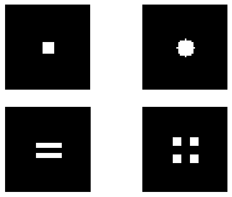
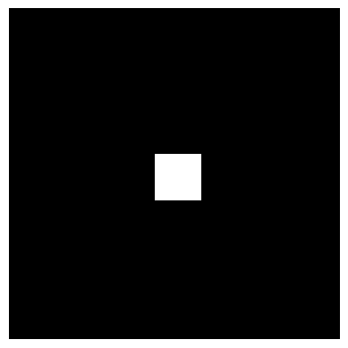
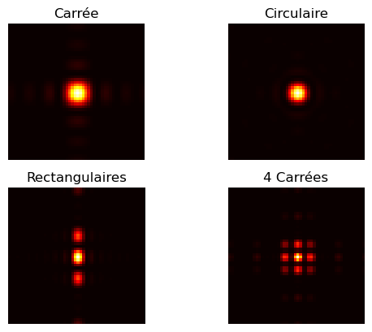
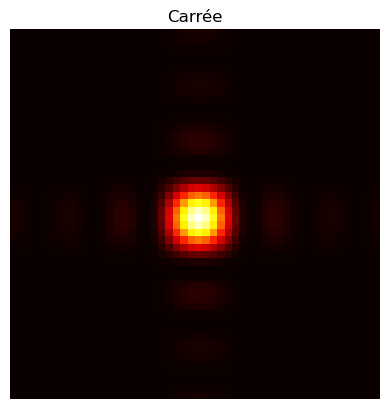
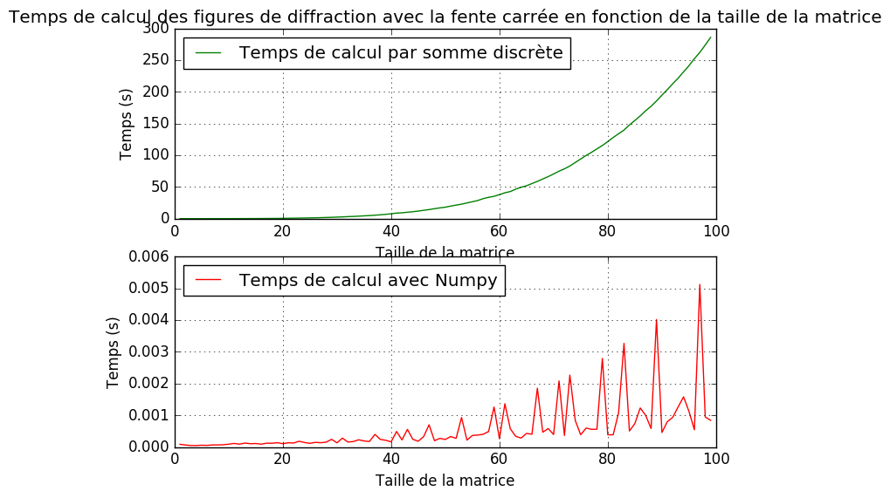
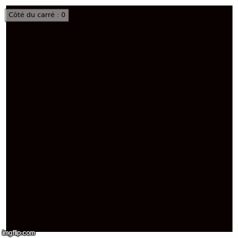

# Figures de diffraction
> Crée des figures de diffraction avec Python !

:warning: Ce projet ne sera pas maintenu par ma personne. Vous pouvez néanmoins proposer des amélioration que j'ajouterais *ou non*. Egalement, j'ai conscience que ces programmes sont *très* loin d'être optimaux, mais il s'agit d'un projet réalisé pendant mes cours d'informatique en Classe Préparatoire aux Grandes Ecoles, spécialité Physique Technologie Sciences de l'Ingénieur, en **1ère année**.
Une fois cela dit, passons à la présentation.

## Contenu
### [Fentes de diffraction](modules/fentes.py)

Vous trouverez dans le dossier [modules](/modules) une variété de *modules...*. Tout d'abord celui des fentes, il vous permet de créer 4 types de fentes, à savoir :
* Carrée ;
* Circulaire ;
* Rectangulaires (au nombre de 2) ;
* Carrées (plus petits que la première fente et au nombre de 4).

### [Diffraction](modules/diffraction.py)

Bon, ici c'est le coeur du sujet ! La formule de base qui nous a été donnée :

  

Vous trouverez sa "traduction" en Python dans le module [diffraction.py](modules/diffraction.py).

### Les autres modules
> Vous vous en doutez, il s'agit d'un projet, donc il faut d'autres modules d'intérêt disons plus pédagogique.

#### [Animation](modules/animation.py)

Celui sert à créer une batterie d'image avec chaque fente histoire d'en faire un GIF. Il permet en autre de suivre l'évolution de la figure de diffraction de la lumière en fonction des paramètres de la fente.

#### [Temps de calcul](modules/temps_calcul.py)

Je pense que son nom est assez explicite mais sait-on jamais. Il permet de comparer le temps que met la méthode par somme discrète (aka la ["traduction de l'intégrale double avec Python"](modules/diffraction.py) avec la fonction Fast Fourrier Transform (FFT) de [Numpy](https://numpy.org), je vous laisse fouiner un peu pour en savoir plus *ou lire les **nombreux** commentaires dans les différents scripts Python....* *Je ne vais pas vous mâcher tout le travaille voyons :stuck_out_tongue: !*

#### [Figures](modules/figures.py)

Je n'en dirais pas trop sur ce module-ci, je vous laisse découvrir par vous même.

## [Présentation](Presentation)

Dans un élan de bonté, je vous partage, ce que ma camarade et moi, avons réalisé en terme de présentation ([diaporama au format PDF](Presentation/Presentation_Github.pdf) *eh oui je ne vous laisse pas le choix, vous pouvez quand-même vous en inspirer mais pas le modifier, c'est déjà pas mal !! Arrêtez de râler, je vous vois derrière votre écran ! :wink:*
Je vous partage également notre [script oral](Presentation/Texte_soutenance_Github.pdf) (si vous n'avez pas compris, il s'agit d'un texte, un fil conducteur, nous permettant de saboir *à peu près* quoi dire).

**TOUT** sera anonymisé. Ne chercher donc pas nos noms et prénoms. Néanmoins, si j'oublie dans enlever, merci de me le signaler.
J'ai également supprimé tout les hyperliens vers des **fichiers extérieurs**, seuls restent les hyperliens internes au diaporama et redirigeants vers un site web. J'ai aussi supprimé des figures dans le diaporamma, histoire que vous n'ayez pas tout et que vous puissiez faire tourner le programme (et vous rendre compte du temps qu'il prend pour tout faire), pensez donc à sa compléxité :wink: !
Grosso modo, je vous laisse tout ce qui concerne la fente carrée, rien de plus.
Bon, je pense avoir tout dit. 

## Modules requis

Vous aurez besoin de deux modules classiques !
* [Matplotlib.pyplot](https://matplotlib.org/) ;
* [Numpy](https://numpy.org)

*Bon, j'utilise aussi le module* **os** *mais il est intégré à Python....*

Pour les installer ou les mettre à jour, ouvrez l'invite de commande (vous pouvez l'ouvrir de différentes façons) puis tapez :
* **Pour installer :**
  * `pip install matplotlib`
  * `pip install numpy`
* **Pour les mettre à jour :**
  * `pip install --upgrade matplotlib`
  * `pip install --upgrade numpy`

## Aperçu

Je vous donne quelques aperçus de ce que fait le programme avec la fente carrée (et un peu plus finalement)

### Les fentes

  

  <em>Toutes les fentes</em>

  

  

  <em>La fente carrée</em>

### Figures de diffraction

  

  <em>Toutes les figures de diffraction par <strong>somme discrète</strong></em>

  

  

  <em>Toutes les figures de diffraction avec <strong>Numpy</strong></em>

  

  <em>Figure de diffraction de la lumière avec une fente carré par <strong>somme discrète</strong></em>

  

  <em>Figure de diffraction de la lumière avec une fente carré avec <strong>Numpy</strong></em>

### Temps de calcul

  

  <em>-</em>

### Animation

  

  <em>Evolution de la figure de diffraction de la lumière avec une fente carrée - <strong>somme discrète</strong></em>

